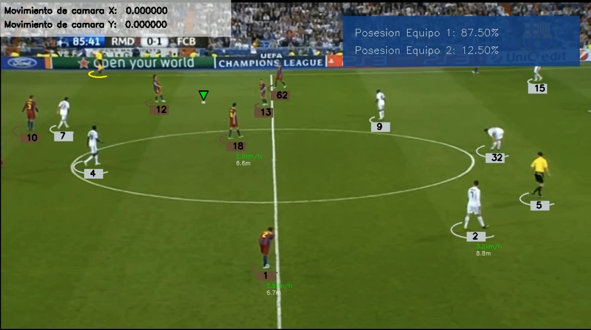

# Sistema de Análisis de Fútbol (DPFRNAA)

Un sistema inteligente de análisis de partidos de fútbol que utiliza inteligencia artificial para detectar jugadores, asignar equipos por color de camiseta, rastrear la posesión del balón y calcular estadísticas de movimiento en tiempo real.

<p align="center">
  
</p>

## Instalación

### Requisitos

- Python 3.8 o superior
- OpenCV
- YOLO (Ultralytics)
- NumPy

(Se sugiere el uso de un entorno en Anaconda para el uso de este programa)

### Configuración

1. **Clona el repositorio**:
   ```bash
   git clone https://github.com/MateoOrtiz001/Deteccion-Partidos-de-Futbol-RNAA
   cd sistema-analisis-futbol
   ```

2. **Crea la estructura de carpetas**:
   ```
   tu_proyecto/
   ├── main.py
   ├── videos/           # Coloca tus videos aquí
   ├── model/            # Coloca tus modelos YOLO aquí (automáticamente cargamos uno pre-entrenado)
   ├── output_videos/    # Se crea automáticamente
   └── stubs/           # Se crea automáticamente (cache)
   ```
## Uso

### Uso Básico

1. **Coloca tu video** en la carpeta `videos/`
2. **Ejecuta el análisis**:
   ```bash
   python main.py -i tu_video.mp4
   ```

El video procesado se guardará automáticamente en `output_videos/tu_video_analyzed.mp4`

### Ejemplos de Comandos

#### Análisis simple
```bash
python main.py -i partido.mp4
```

#### Con modelo personalizado
```bash
python main.py -i partido.mp4 -m mi_modelo.pt
```

#### Con información detallada
```bash
python main.py -i partido.mp4 -v
```

#### Desactivar funciones específicas
```bash
python main.py -i partido.mp4 --no-cache --no-interpolation
```

#### Directorio de salida personalizado
```bash
python main.py -i partido.mp4 -o mis_resultados/
```

#### Usar rutas completas
```bash
python main.py -i /ruta/completa/partido.mp4 -m /otra/ruta/modelo.pt
```

## Opciones Disponibles

### Argumentos Obligatorios

| Argumento | Descripción | Ejemplo |
|-----------|-------------|---------|
| `-i, --input` | Video de entrada | `-i partido.mp4` |

### Argumentos Opcionales

| Argumento | Descripción | Default | Ejemplo |
|-----------|-------------|---------|---------|
| `-m, --model` | Modelo YOLO | `best.pt` | `-m custom.pt` |
| `-o, --output-dir` | Directorio de salida | `output_videos` | `-o resultados/` |
| `--stub-dir` | Directorio de cache | `stubs` | `--stub-dir cache/` |
| `-v, --verbose` | Información detallada | False | `-v` |

### Opciones de Desactivación

| Argumento | Descripción |
|-----------|-------------|
| `--no-cache` | Desactivar sistema de cache |
| `--no-interpolation` | Desactivar interpolación de pelota |
| `--no-camera-movement` | Desactivar compensación de cámara |
| `--no-perspective` | Desactivar transformación de perspectiva |
| `--no-speed-distance` | Desactivar cálculo de velocidad/distancia |

## Estructura de Archivos

```
sistema-analisis-futbol/
├── main.py                    # Archivo principal
├── README.md                  # Este archivo
├── requirements.txt           # Dependencias
├── utils.py                   # Utilidades de video
├── trackers.py               # Sistema de tracking
├── assigner.py               # Asignador de equipos
├── asignadorJugador.py       # Asignador de jugador-balón
├── mov_camera.py             # Estimador de movimiento
├── perspective_transformer.py # Transformador de perspectiva
├── info.py                   # Calculador de estadísticas
├── videos/                   # Coloca tus videos aquí
│   ├── partido1.mp4
│   └── partido2.mp4
├── model/                    # Coloca tus modelos aquí
│   ├── best.pt
│   └── custom_model.pt
├── output_videos/            # Videos procesados (auto-creada)
│   ├── partido1_analyzed.mp4
│   └── partido2_analyzed.mp4
└── stubs/                    # Cache del sistema (auto-creada)
    ├── track_stubs.pkl
    └── camera_movement_stub.pkl
```

## Funcionalidades Técnicas

### 1. Detección y Seguimiento
- Utiliza YOLO para detectar jugadores, balón y árbitros
- Asigna IDs únicos y mantiene seguimiento entre frames
- Sistema de cache para evitar reprocesar

### 2. Asignación de Equipos
- Analiza colores de camisetas automáticamente
- Distingue entre equipos basándose en colores dominantes
- Asigna cada jugador a su equipo correspondiente

### 3. Análisis de Movimiento
- Compensa el movimiento de cámara para mediciones precisas
- Transforma perspectiva para cálculos en coordenadas reales
- Calcula velocidad y distancia recorrida por cada jugador

### 4. Seguimiento del Balón
- Detecta la posesión del balón en tiempo real
- Interpola posiciones cuando el balón no es visible
- Rastrea estadísticas de posesión por equipo

## Resolución de Problemas

### El video no se encuentra
```bash
Error: No se encontró el video 'partido.mp4' en la carpeta 'videos/'
```
**Solución**: Verifica que el video esté en la carpeta `videos/` o usa la ruta completa.

### El modelo no se encuentra
```bash
Error: No se encontró el modelo 'best.pt' en la carpeta 'model/'
```
**Solución**: Coloca tu modelo YOLO en la carpeta `model/` o usa la ruta completa.

### Error de memoria
Si el video es muy grande, puedes:
- Usar `--no-cache` para reducir uso de memoria
- Procesar videos más cortos

### Procesamiento lento
Para acelerar el procesamiento:
- Usar cache: omite `--no-cache`
- Desactivar funciones innecesarias con `--no-*`

## Licencia

Este proyecto está bajo la Licencia MIT. Ver `LICENSE` para más detalles.

## Agradecimientos

- [Ultralytics YOLO](https://github.com/ultralytics/yolov5) por el sistema de detección
- [OpenCV](https://opencv.org/) por las herramientas de visión por computadora
- La comunidad de análisis deportivo por inspiración y feedback

---
